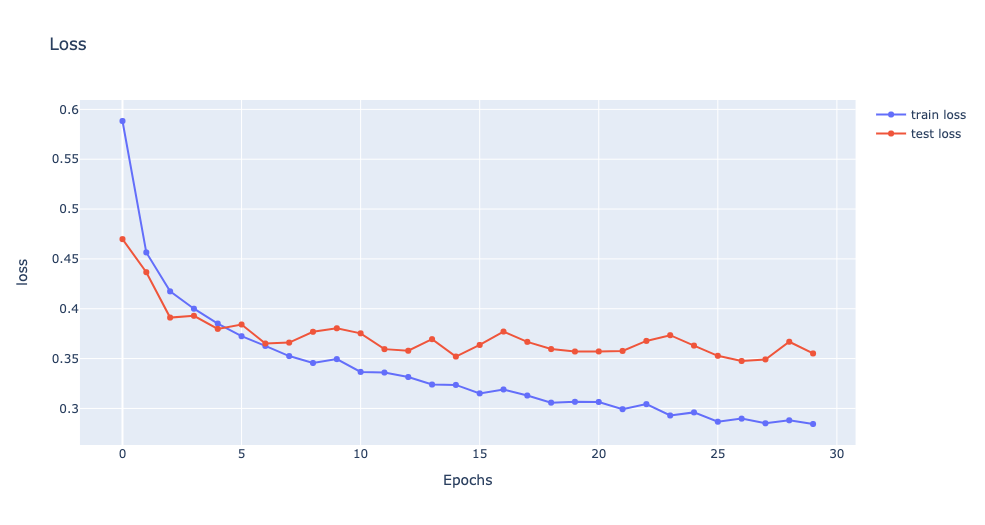

# 说明

计算机视觉论文撰写，先用markdown

# 摘要

计算机视觉（Computer vision）是一门研究如何使机器“看”的科学，更进一步的说，就是指用摄影机和计算机代替人眼对目标进行识别、跟踪和测量等机器视觉，并进一步做图像处理，用计算机处理成为更适合人眼观察或传送给仪器检测的图像。在本次
计算机视觉包括很多任务，包括目标检测，目标跟踪，图像分类等，图像分类，根据各自在图像信息中所反映的不同特征，把不同类别的目标区分开来的图像处理方法。它利用计算机对图像进行定量分析，把图像或图像中的每个像元或区域划归为若干个类别中的某一种，以代替人的视觉判读。
本次我们使用Fashion MNIST数据集完成图像分类任务，其涵盖了来自10种类别的共7万个
不同商品的正面图片.起初我们只是使用dnn来完成图像分类任务,dnn在本次任务上，验证
集的分类准确率可以达到88%左右，然而dnn在这种含有空
间的特征方面学习的不是很好。于是我们接着尝试使用Transformer来完成图像分类，
Transformer原本是完成NLP等任务，我们对模型使用了迁移学习方法，最后Transformer
在验证集的准确率有90%，接下来我们还使用了Resnet网络对图像进行分类，准确率可以
达到91%-92%，说明以CNN为backbone的网络，在对图像特征的提取方面还是要高于其他机
制的主干网络。


# 引言

计算机视觉（Computer Vision）是人工智能领域的一个重要分支。它的目的是：看懂图片里的内容。
人类的视觉原理如下：从原始信号摄入开始（瞳孔摄入像素 Pixels），接着做初步处理（大脑皮层某些细胞发现边缘和方向），然后抽象（大脑判定，眼前的物体的形状，是圆形的），然后进一步抽象（大脑进一步判定该物体是只气球）。
机器的方法也是类似：构造多层的神经网络，较低层的识别初级的图像特征，若干底层特征组成更上一层特征，最终通过多个层级的组合，最终在顶层做出分类。

接下来我们将使用Fashion MNIST数据集完成分类任务，首先我们将介绍一下Fashion
MNIST数据集，然后使用DNN来完成图像分类，与CNN模型的训练进行对比，并分析下实验
结果。

# 数据集和思路说明

## 数据集介绍

Fashion-MNIST是一个替代MNIST手写数字集的图像数据集。 它是由Zalando（一家德国的时尚科技公司）旗下的研究部门提供。其涵盖了来自10种类别的共7万个不同商品的正面图片。Fashion-MNIST的大小、格式和训练集/测试集划分与原始的MNIST完全一致。60000/10000的训练测试数据划分，28x28的灰度图片。你可以直接用它来测试你的机器学习和深度学习算法性能，且不需要改动任何的代码。
Fashion-MNIST的目的是要成为MNIST数据集的一个直接替代品。作为算法作者，你不需要修改任何的代码，就可以直接使用这个数据集。Fashion-MNIST的图片大小，训练、测试样本数及类别数与经典MNIST完全相同。

## 思路说明

因为数据集中每张图片都是灰度图片，图片的存储方式其实就是矩阵或者说是张量，因为
是灰度图片，所以每张图片都可以用一个1\*28\*28的三维张量表示，因为DNN网络对输入
有要求，网络输入是一个向量，输出是另一个向量，这两个向量的维度可以不一样，所以
我们必须找到一个向量，这个向量能很好的表示这个图片。最简单的方法就是将这个图片
像素拉直，即28\*28的图片，可以用一个1\*784的向量表示，然后我们将这个向量输入到
模型中训练的到结果。

上面我们是将图片拉直来，用这个向量表示这个图片，除了这个方法外，我们可以使用以
CNN为backbone的网络来进行训练，原理就是使用很多卷积核来学习图片中的特征，然后
将特征展平，使用线性层来进行分类。

# DNN模型

## DNN模型介绍

dnn 的本质其实就是特征变换，dnn的输入是一个向量，经过某一层神经元后，转变成 另一个向量. 经过神经元相当于向量乘以一个矩阵，然后转换成另一个向量。
 
<center>DNN结构图</center>

dnn 的另一个作用就是输出一个概率分布，可以用来完成分类任务, 因此最后一层输出，
我们将使用Softmax函数，将输出转换成概率分布。
dnn 有个作用就是降低维度。相当于PCA，什么是降低数据维度？就是有些特征对结果 影响不是很大，目的是去除一些无关变量，找出一些主要的特征。降维有什么好处？首 先可以加速模型的训练，因为特征变少了，需要的参数也对应变少了。其次可以防止模 型过拟合，因为过拟合是模型学到了一些无关特征，而降维就是去除一些无关特征。

## DNN模型训练

```
import torch
import torchvision
from torchvision import datasets, transforms
from tqdm import tqdm
from torch import nn, optim
import torch.nn.functional as F

# 对图片数据进行转换，因为Fashion minist是灰度图，所以使用下面的normalization方式
transform = transforms.Compose([
transforms.ToTensor(), transforms.Normalize([0.5], [0.5])])

# 数据下载与封装
train_set = datasets.FashionMNIST('./', download = True, train = True, transform = transform)
test_set = datasets.FashionMNIST('./', download = True, train = False, transform = transform)
train_loader = torch.utils.data.DataLoader(train_set, batch_size = 64, shuffle = True)
test_loader = torch.utils.data.DataLoader(test_set, batch_size = 64, shuffle = True)

model = nn.Sequential(nn.Linear(784, 256),
                      nn.ReLU(),
                      nn.Dropout(0.2),
                      nn.Linear(256, 128),
                      nn.ReLU(),
                      nn.Dropout(0.2),
                      nn.Linear(128, 64),
                      nn.ReLU(),
                      nn.Dropout(0.2),
                      nn.Linear(64, 10),
                      nn.LogSoftmax(dim = 1)
                     )
# Define the loss
# NLLLoss 是似然损失函数的一种，参考：https://zhuanlan.zhihu.com/p/83283586
# 常用在分类任务中
criterion = nn.NLLLoss()

# Define the optimizer
optimizer = optim.Adam(model.parameters(), lr = 0.002)

# Define the epochs
epochs = 30

train_losses, test_losses = [], []
train_acc, test_acc = [], []
for e in range(epochs):
    running_loss = 0
    epoch_train_acc = 0
    model.train()
    for images, labels in train_loader:
    # Flatten Fashion-MNIST images into a 784 long vector
        images = images.view(images.shape[0], -1)
        
        # Training pass
        optimizer.zero_grad()
        
        output = model.forward(images)
        loss = criterion(output, labels)
        loss.backward()
        optimizer.step()
        ps = torch.exp(output)
        top_p, top_class = ps.topk(1, dim=1)
        equals = top_class == labels.view(*top_class.shape)
        epoch_train_acc += torch.mean(equals.type(torch.FloatTensor))
        
        running_loss += loss.item()
    test_loss = 0
    accuracy = 0

    with torch.no_grad():
        model.eval()
        for images, labels in test_loader:
            images = images.view(images.shape[0], -1)
            log_ps = model(images)
            test_loss += criterion(log_ps, labels)
            
            ps = torch.exp(log_ps)
            top_p, top_class = ps.topk(1, dim = 1)
            equals = top_class == labels.view(*top_class.shape)
            accuracy += torch.mean(equals.type(torch.FloatTensor))
    
    train_losses.append(running_loss/len(train_loader))
    test_losses.append(test_loss/len(test_loader))
    train_acc.append(epoch_train_acc/len(train_loader))
    test_acc.append(accuracy/len(test_loader))
    
    print("Epoch: {}/{}..".format(e+1, epochs),
          "Training loss: {:.3f}..".format(running_loss/len(train_loader)),
          "Test loss: {:.3f}..".format(test_loss/len(test_loader)),
          "Test Accuracy: {:.3f}".format(accuracy/len(test_loader)))
```
## DNN训练结果可视化

 
<center>DNN 准确率图 </center>

 
<center>DNN 损失函数图</center>

# CNN模型

## CNN模型介绍

CNN其实就是DNN网络的一种变形，只不过在设计CNN的时候，修改了网络的结构。

 
<center>cnn原理图</center>

CNN中，每个卷积核都共享一组参数，所以CNN中需要更新的参数量其实就是卷积核大小，
再加上一些偏置，相比与DNN，这种网络结构大大降低了模型的复杂度。

同时，卷积核还能很好地学习图片中的二维特征, 在网络中，我们可以使用很多个卷积核
，来学习不同的特征。

除了卷积核以外，CNN中还经常出现另一种网络层，叫做池化层，池化主要作用是降低网
络的参数。常见的池化有MaxPooling，AveragePooling等。在课程的学习中，我了解到，
池化有时候可以去除噪声，因为有些极值点，要么是极大值，要么是极小值，当异常点是
极大值的时候，我们只要使用AveragePooling池化层就好了，当异常点为极小值点时，我
们Max Pooling和AveragePooling都可以，池化层的选择要根据不同的任务自己设置，不
同池化的效果不一样。

其次是为了方便训练卷积核提取对应特征，因为Max Pooling的更新方式是只有最大的神经元的参数会更新，其他的不会变化，这样更能有效训练出卷积核。

Resnet是一种以CNN为backbone的深度神经网络，在通常的深度学习中，随着网络的加深
，CNN的学习效果反而会有所下降，因此有人发明了残差网络结构，可以类比于电路的短
路过程，因此反而可以让模型学的更好。

## Resnet模型训练

```
import torchvision
import torch.nn as nn
import torch.optim as optim
import torch.nn.functional as F
from tqdm import tqdm

model = torchvision.models.resnet18(pretrained=True)
for name, layer in model.named_modules():
    if isinstance(layer, nn.MaxPool2d):
        model.maxpool = nn.AdaptiveAvgPool2d((7, 7))
# 因为数据集是10分类，所以这里设置为10
model.fc.out_features = 10
# 因为resnet不进行修改的话，只能用于彩色图片，所以这里要对数据进行处理
# 我们可以在前面加个卷积核，将通道映射到3，然后输入到resnet中, 也可以直接修改resnet第一层通道为1
model.conv1 = nn.Conv2d(1, 64, kernel_size=(7, 7), stride=(2, 2), padding=(3, 3))
batch_size = 128
epochs = 30
lr = 0.001
gamma = 0.9
step_size=5

device_count = torch.cuda.device_count()
USE_CUDA = torch.cuda.is_available()
device = torch.device("cuda:0" if USE_CUDA else "cpu")

if device_count > 1:
    model = nn.DataParallel(model,device_ids=range(device_count)) # multi-GPU
    model.to(device)

else:
    model = model.cuda()

criterion = nn.CrossEntropyLoss()
optimizer = optim.Adam(model.parameters(), lr=lr)
scheduler = optim.lr_scheduler.StepLR(optimizer, step_size=1, gamma=gamma) # 学习方式
# 训练模型
train_acc, test_acc = [], []
train_loss, test_loss = [], []
for epoch in range(epochs):
    epoch_loss = 0
    epoch_accuracy = 0
    for data, label in tqdm(train_loader):
        data = data.cuda()
        label = label.cuda()
        output = model(data)
    
        loss = criterion(output, label)
        
        optimizer.zero_grad()
        loss.backward()
        optimizer.step()
        
        acc = (output.argmax(dim=1) == label).float().mean()
        epoch_accuracy += acc / len(train_loader)
        epoch_loss += loss / len(train_loader)
        
        data.cpu()
        label.cpu()

    with torch.no_grad():
        epoch_test_accuracy = 0
        epoch_test_loss = 0
        for data, label in tqdm(test_loader):
            data = data.cuda()
            label = label.cuda()
            
            test_output = model(data)
            loss = criterion(test_output, label)
            
            acc = (test_output.argmax(dim=1) == label).float().mean()
            epoch_test_accuracy += acc / len(test_loader)
            epoch_test_loss += loss / len(test_loader)
            data.cpu()
            label.cpu()
    scheduler.step()
    
    print(f'EPOCH:{epoch:2}, train loss:{epoch_loss:.4f}, train acc:{epoch_accuracy:.4f}')
    print(f'test loss:{epoch_test_loss:.4f}, test acc:{epoch_test_accuracy:.4f}')

    train_acc.append(epoch_accuracy.item())
    test_acc.append(epoch_test_accuracy.item())
    train_loss.append(epoch_loss.item())
    test_loss.append(epoch_test_loss.item())
```

## Resnet训练结果可视化


 
<center>Resnet网络准确率</center>


 
<center>Resnet网络损失函数</center>
