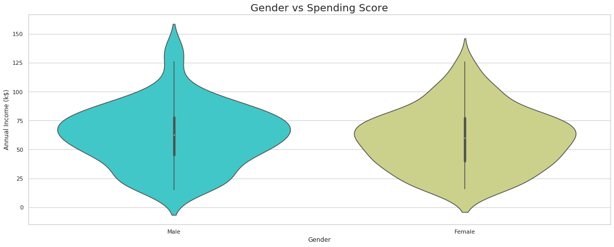

[TOC]

# 说明

参考：https://www.kaggle.com/roshansharma/mall-customers-clustering-analysis

# 摘要

本文以商场用户消费数据，根据商场用户的数字特征进行数据分析，首先使用Python语言，对用户的年龄，性别和消费能力之间的统计关系进行了探索，可视化了用户群体不同年龄之间的商场消费水平以及不同性别用户的消费水平的区别，此外还进一步探索了数据特征之间的相关性。然后使用K-means算法对数据中所有用户群体进行了聚类分析，最后将该商场的所有用户分成了4个类别，能够为后续商场的销售决策作为参考。

关键词：用户消费数据，聚类分析，K-means算法，销售决策

# 数据分析

## 数据介绍

本文数据使用的是商场用户消费数据，该数据是通过成员卡
获得商场消费用户的一些基础数据特征，如：消费用户的年龄，性别，年收入和消费能力
指数。其中消费能力指数是根据用户的消费能力和消费习惯进行打分，分数在0-100之间。然后我们可以通过这些数据特征，对消费用户进行聚类, 将该商场中的消费用户划分为不同的群体
，然后针对不同的群体，指定不同的销售计划，促进商场的消费。

## 环境配置

```
import pandas as pd
import numpy as np

from pandas import plotting
import matplotlib.pyplot as plt
import seaborn as sns

import plotly.graph_objs as go
from plotly import tools
import plotly.figure_factory as ff
```

## 数据读取

```
df = pd.read_csv('./data/Mall_Customers.csv')
print(df.head())
```

|      | CustomerID | Gender | Age  | Annual Income (k$) | Spending Score (1-100) |
| ---: | :--------: | :----: | :--: | :----------------: | :--------------------: |
|    0 |     1      |  Male  |  19  |         15         |           39           |
|    1 |     2      |  Male  |  21  |         15         |           81           |
|    2 |     3      | Female |  20  |         16         |           6            |
|    3 |     4      | Female |  23  |         16         |           77           |
|    4 |     5      | Female |  31  |         17         |           40           |

```
# 检查是否有缺失值
df.isnull().any()
```

```
CustomerID                False
Gender                    False
Age                       False
Annual Income (k$)        False
Spending Score (1-100)    False
dtype: bool
```

## 性别数据分析

```
df['Gender'].value_counts()
```

```
Female    112
Male       88
Name: Gender, dtype: int64
```

```
# 对年龄分布进行探索, 发现数据性别还是比较均衡的
sns.set(style = 'whitegrid')
sns.countplot(data=df, x='Gender')
```

 

```
labels = ['Female', 'Male']
size = df['Gender'].value_counts()
colors = ['lightgreen', 'orange']
explode = [0, 0.1]

plt.rcParams['figure.figsize'] = (9, 9)
plt.pie(size, colors = colors, explode = explode, labels = labels, shadow = True, autopct = '%.2f%%')
plt.title('Gender', fontsize = 20)
plt.axis('off')
plt.legend()
plt.show()
```

 

## 年龄数据分析

```
plt.figure(figsize=(20,5))
plt.subplot(1,3,1)
sns.boxplot(x=df.Gender, y=df.Age)
plt.title('Age')

plt.subplot(1,3,2)
sns.boxplot(x=df.Gender, y=df['Annual Income (k$)'])
plt.title('Income')

plt.subplot(1,3,3)
sns.boxplot(x=df.Gender, y=df['Spending Score (1-100)'])
plt.title('Score')

plt.show()
```

 

```
import warnings
warnings.filterwarnings('ignore')
plt.subplot(1, 2, 1)
sns.set(style = 'whitegrid')
sns.distplot(df['Annual Income (k$)'])
plt.title('Distribution of Annual Income', fontsize = 20)
plt.xlabel('Range of Annual Income')
plt.ylabel('Count')


plt.subplot(1, 2, 2)
sns.set(style = 'whitegrid')
sns.distplot(df['Age'], color = 'red')
plt.title('Distribution of Age', fontsize = 20)
plt.xlabel('Range of Age')
plt.ylabel('Count')
plt.show()
```

 

 
- 对于用户的收入情况来说，从上图中可以发现, 很少消费者的年收入可以高于100k美元，大部分人的收入只是在50-75K美元之间，我们还可以发现，消费群体中，最低年收入大概是20k美元
- 对于年龄分布来说，通常在商场购物的消费者年龄分布在30-35之间
- 老年人很少来商场进行购物
- 同样，青少年来商场购物的频率还是低于中年群体的

```
plt.rcParams['figure.figsize'] = (15, 8)
sns.countplot(df['Age'], palette = 'hsv')
plt.title('Distribution of Age', fontsize = 20)
plt.show()
```

 

- 这个图表更加细化了年龄，统计了商场中每个年龄的人数情况
- 将年龄细化后，我们不能得出中年群体访问商场的频率会更高
- 我们只能发现，相对于中年群体，老年群体的购物频率，要低于中年群体
- 年龄在55，56，69,的群体，几乎没有购物
- 而年龄在32岁左右的人，到访商场的频率最高
## 用户收入数据分析

```
# 收入分布
plt.rcParams['figure.figsize'] = (20, 8)
sns.countplot(df['Annual Income (k$)'], palette = 'rainbow')
plt.title('Distribution of Annual Income', fontsize = 20)
plt.show()
```

 

- 同样，我们细化了年收入分布，这个图能更好地表示消费用户的收入水平
- 我们可以发现，不论用户的年收入是高还是低，访问商场的频率都差不多，只有某些收入到访频率会高一些
- 但是我们能发现年收入在54-78之间的访问频率，要比其他收入区间的频率要高

## 用户消费指数分析

```
# 消费指数分布图
plt.rcParams['figure.figsize'] = (20, 8)
sns.countplot(df['Spending Score (1-100)'], palette = 'copper')
plt.title('Distribution of Spending Score', fontsize = 20)
plt.show()
```

 

- 这个指数是最重要的一个特征了
- 这个消费分数分布，隐约有点正太分布的趋势
- 从图中我们可以看出，大部分消费用户的消费指数在35-60分左右
- 图像呈现出中间高，两边低的趋势
- 这说明商场的商品种类丰富，能够很好的迎合不同消费能力的用户

```
sns.pairplot(df)
plt.title('Pairplot for the Data', fontsize = 20)
plt.show()
```

 

```
# 绘制相关系数图
plt.rcParams['figure.figsize'] = (15, 8)
sns.heatmap(df.corr(), cmap = 'Wistia', annot = True)
plt.title('Heatmap for the Data', fontsize = 20)
plt.show()
```

 

什么是相关系数？

- 数据集中有很多特征，如果只比较两个特征，即一个特征如果变化，另一个特征也跟着变化
- 如果两个特征的变化趋势是一样的，那么相关系数的绝对值就会趋向于1，如果是正1那么呈现出正相关，反之则是负相关
- 如果相关系数趋于0，那么说明两个系数的相关程度不大
- 图中，如果颜色越深，则说明相关系数越高。
- 从图中可以发现，并没有哪些特征的相关性比较好，所以还需要进一步分析


```
plt.rcParams['figure.figsize'] = (18, 7)
sns.boxenplot(df['Gender'], df['Spending Score (1-100)'], palette = 'Blues')
plt.title('Gender vs Spending Score', fontsize = 20)
plt.show()
```

 


- 接下来根据不同的性别，分析性别群体的消费指标
- 从图中可以看出，男性群体消费指标主要在25k-70k美元左右
- 然而女性群体消费指标主要在35-75k美元左右
- 由此可以发现，女性在更喜欢在商场中购物

```
plt.rcParams['figure.figsize'] = (18, 7)
sns.violinplot(df['Gender'],df['Annual Income (k$)'], palette = 'rainbow')
plt.title('Gender vs Spending Score', fontsize = 20)
plt.show()
```

 

```
x = df['Annual Income (k$)']
y = df['Age']
z = df['Spending Score (1-100)']

sns.lineplot(x, y, color = 'blue')
sns.lineplot(x, z, color = 'pink')
plt.title('Annual Income vs Age and Spending Score', fontsize = 20)
plt.show()
```

 

- 图中蓝色的线是年收入和年龄的折线图
- 图中粉色折线是年收入和消费指数的折线图
- 通过折线图我们可以看出两者的差异

# 算法分析

## K-means算法说明

聚类就是事先不知道数据会分为几类，通过聚类分析将数据聚合成几个群体。聚类不需要对数据进行训练和学习。属于无监督学习。其中无监督学习就是模型的输入不需要提供真实的标签，如果有标签，则为有监督学习。

k-means算法流程如下：

- 随机初始化K类中心向量
- 基于上述中心向量对每个数据样本进行归类，即计算每个样本离中心点的距离，样本离
  哪个最近就归类为哪一个
- 归类完成后，计算每个类别的中心点，作为新的中心向量
- 不断重复前两个步骤，直到中心点收敛，即变化不大

 

## 算法实现

```
x = df.iloc[:, [3, 4]].values

from sklearn.cluster import KMeans

wcss = []
for i in range(1, 11):
    km = KMeans(n_clusters = i, init = 'k-means++', max_iter = 300, n_init = 10, random_state = 0)
    km.fit(x)
    wcss.append(km.inertia_)
    
plt.plot(range(1, 11), wcss)
plt.title('The Elbow Method', fontsize = 20)
plt.xlabel('No. of Clusters')
plt.ylabel('wcss')
plt.show()
```

 

## 结果可视化

```
# 聚类结果可视化
km = KMeans(n_clusters = 5, init = 'k-means++', max_iter = 300, n_init = 10, random_state = 0)
y_means = km.fit_predict(x)

plt.scatter(x[y_means == 0, 0], x[y_means == 0, 1], s = 100, c = 'pink', label = 'miser')
plt.scatter(x[y_means == 1, 0], x[y_means == 1, 1], s = 100, c = 'yellow', label = 'general')
plt.scatter(x[y_means == 2, 0], x[y_means == 2, 1], s = 100, c = 'cyan', label = 'target')
plt.scatter(x[y_means == 3, 0], x[y_means == 3, 1], s = 100, c = 'magenta', label = 'spendthrift')
plt.scatter(x[y_means == 4, 0], x[y_means == 4, 1], s = 100, c = 'orange', label = 'careful')
plt.scatter(km.cluster_centers_[:,0], km.cluster_centers_[:, 1], s = 50, c = 'blue' , label = 'centeroid')

plt.style.use('fivethirtyeight')
plt.title('K Means Clustering', fontsize = 20)
plt.xlabel('Annual Income')
plt.ylabel('Spending Score')
plt.legend()
plt.grid()
plt.show()
```

 


- 从聚类结果可以清楚地了解商场中不同用户群的情况
- 从图中可以发现，根据消费群体的年收入和消费指数可以将用户分成5个部分, 这两个参数是将用户区分开来的最好参数
- 为什么是这两个参数呢？因为我们从之前的想关系数看出来的

```
x = df.iloc[:, [2, 4]].values
from sklearn.cluster import KMeans

wcss = []
for i in range(1, 11):
    kmeans = KMeans(n_clusters = i, init = 'k-means++', max_iter = 300, n_init = 10, random_state = 0)
    kmeans.fit(x)
    wcss.append(kmeans.inertia_)

plt.rcParams['figure.figsize'] = (15, 5)
plt.plot(range(1, 11), wcss)
plt.title('K-Means Clustering(The Elbow Method)', fontsize = 20)
plt.xlabel('Age')
plt.ylabel('Count')
plt.grid()
plt.show()
```

 

```
kmeans = KMeans(n_clusters = 4, init = 'k-means++', max_iter = 300, n_init = 10, random_state = 0)
ymeans = kmeans.fit_predict(x)

plt.rcParams['figure.figsize'] = (10, 10)
plt.title('Cluster of Ages', fontsize = 30)

plt.scatter(x[ymeans == 0, 0], x[ymeans == 0, 1], s = 100, c = 'pink', label = 'Usual Customers' )
plt.scatter(x[ymeans == 1, 0], x[ymeans == 1, 1], s = 100, c = 'orange', label = 'Priority Customers')
plt.scatter(x[ymeans == 2, 0], x[ymeans == 2, 1], s = 100, c = 'lightgreen', label = 'Target Customers(Young)')
plt.scatter(x[ymeans == 3, 0], x[ymeans == 3, 1], s = 100, c = 'red', label = 'Target Customers(Old)')
plt.scatter(kmeans.cluster_centers_[:, 0], kmeans.cluster_centers_[:, 1], s = 50, c = 'black')

plt.style.use('fivethirtyeight')
plt.xlabel('Age')
plt.ylabel('Spending Score (1-100)')
plt.legend()
plt.grid()
plt.show()
```
 

- 同样根据之前的相关系数，我们可以根据年龄和消费指数将用户进行划分
- 通过测试，可以发现分成4个类别是效果比较好的
- 我们可以根据此结论指定不同的营销策略和政策，以优化用户在商城的消费得分

# 参考文献

https://blog.csdn.net/huangfei711/article/details/78480078
