[TOC]

# 摘要

心脏病是一类比较常见的循环系统疾病。循环系统由心脏、血管和调节血液循环的神经体
液组织构成，循环系统疾病也称为心血管病，包括上述所有组织器官的疾病，在内科疾病
中属于常见病，其中以心脏病最为多见，能显著地影响患者的劳动力。

本论文使用的是Kaggle上的"Heart Attack Analysis"数据集。该数据集一共收集了303位实验对象的信
息，其中包括实验对象的性别，年龄，心率等特征。论文针对这些特征进行分析
,利用决策树和逻辑回归等算法，发现年龄和心脏病发病率提升病没有很强的关系。

关键词：心脏病数据，决策树，逻辑回归

# 引言

心脏病是一类比较常见的循环系统疾病。探索心脏病引发的因素是一个很有必要并且非常
有趣的过程，论文中通过使用kaggle上的"Heart Attack Analysis"数据集进行分析。首
先我们通过Python中的pandas模块，对表格的数据进行处理，期间使用Matplotlib以及
Plotly，seaborn的可视化模块，对数据进行可视化，对数据进行了初步的分析。最后通
过Sklearn中的SVM，逻辑回归，以及决策树对数据进行分类，并找出影响心脏病引发的重
要因素。

# 数据处理

导入模块
```
# 数据处理模块
import pandas as pd
import numpy as np

# 数据可视化模块
import seaborn as sns
import plotly.express as px
import matplotlib.pyplot as plt
from plotly.subplots import make_subplots
import plotly.graph_objects as go
import plotly.figure_factory as ff
```

查看数据

```
df = pd.read_csv('./data/heart.csv')
df.head(3)
```

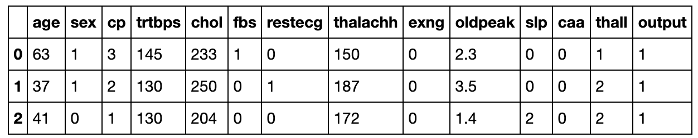 

查看缺失值:

```
df.isnull().any()
```

```
age         False
sex         False
cp          False
trtbps      False
chol        False
fbs         False
restecg     False
thalachh    False
exng        False
oldpeak     False
slp         False
caa         False
thall       False
output      False
dtype: bool
```

## 数据说明

性别: 病人的性别1 男性 0 女性

年龄

exang: 是否为运行诱发的心绞痛 1 yes 0 no

cp: 胸痛类型

- 1 典型心绞痛
- 2 非典型心绞痛
- 3 非心绞痛类型
- 4 无症状

trtbps: 平静时候血压值

chol: 通过 BMI 传感器获取的以 mg / dl 为单位的胆固醇

fbs: 空腹时候的血糖 是否大于120mg/dl

rest_ecg:静息时心电图

- 0 正常
- 1 有异常，只是不确定
- 2 确定有问题

thalach: 达到的最大心率

数据标签target: 0 表示心脏病发作几率减少 1 表示发作概率增加

通过调查发现, 心脏病引发的原因：

- 主要是心脏部位供血供氧不足
- 如果是肥胖因素，胆固醇会积累成块状
- 当块体破裂，就会堵到心血管，然后引发心脏病

## 单变量数据分析

查看一些常见的统计数据

```
df.describe().transpose()
```
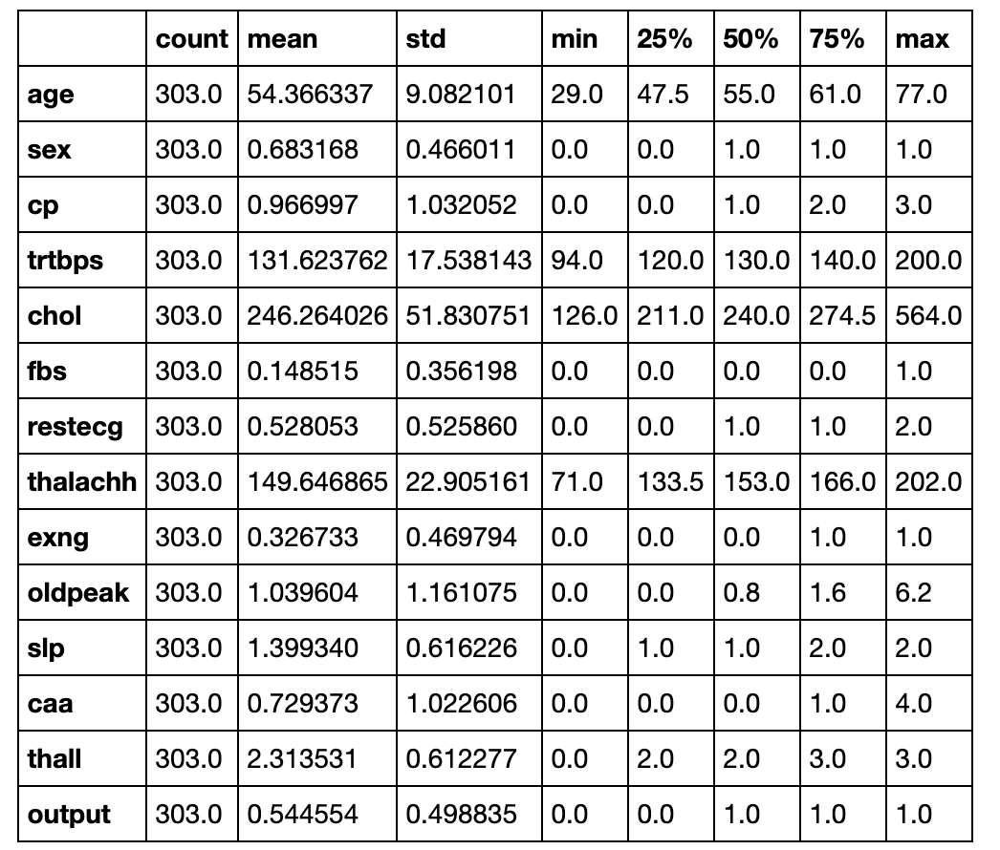 

年龄单变量分析

```
plt.figure(figsize=(10,5))
sns.countplot(x=df["age"])
plt.title("Age Counts",fontsize=20)
plt.xlabel("AGE",fontsize=20)
plt.ylabel("COUNT",fontsize=20)
plt.show()
```

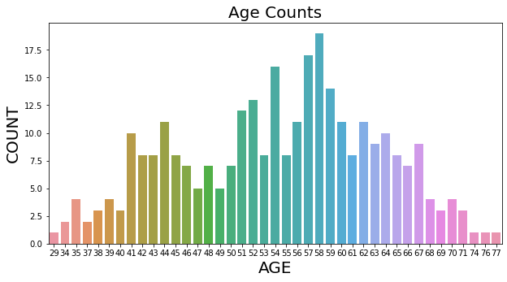 

```
sns.displot(df["age"])
plt.title("Age Distribution",fontsize=20)
plt.show()
```

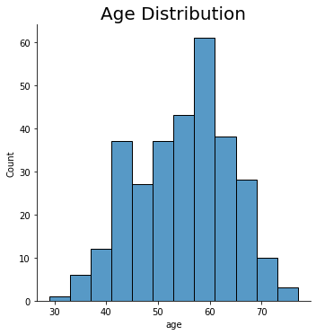 

1. 可以发现数据中年龄分布大概呈现出正太分布的样子
2. 据中年龄的分布在29-77岁之间

性别单变量分析

```
s=df["sex"].value_counts().reset_index()
px.pie(s ,names="index" ,values="sex")
```
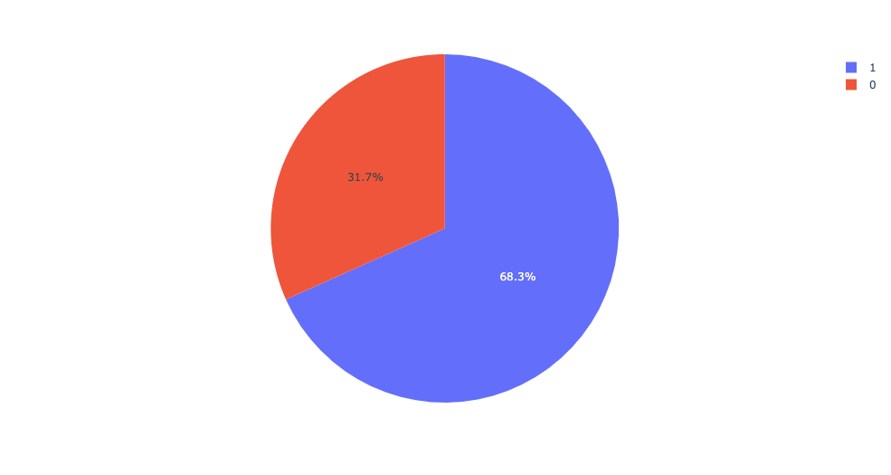 

胸痛类型单变量分析

```
c=df["cp"].value_counts().reset_index()
plt.figure(figsize=(10, 5))
sns.barplot(x=c["index"],y=c["cp"])
plt.title("TYPE OF CHEST PAIN",fontsize=20)
plt.xlabel("TYPE",fontsize=20)
plt.ylabel("COUNT",fontsize=20)
plt.show()
```

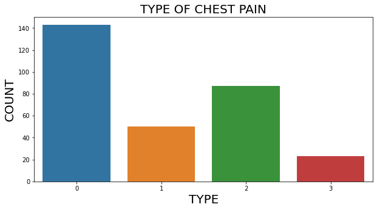 


cp: 胸痛类型

- 1 典型心绞痛
-  非典型心绞痛
-  非心绞痛类型
-  无症状

```
c=df["cp"].value_counts().reset_index()
plt.figure(figsize=(10, 5))
sns.barplot(x=c["index"],y=c["cp"])
plt.title("TYPE OF CHEST PAIN",fontsize=20)
plt.xlabel("TYPE",fontsize=20)
plt.ylabel("COUNT",fontsize=20)
plt.show()
```

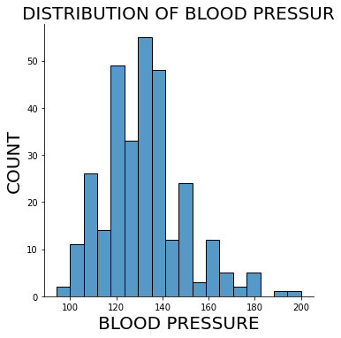 

心率单变量分析

```
sns.displot(df["thalachh"])
plt.title("DISTRIBUTION OF HEART RATE AROUND PATIENTS",fontsize=20)
plt.xlabel("HEART RATE",fontsize=20)
plt.ylabel("COUNT",fontsize=20)
plt.show()
```

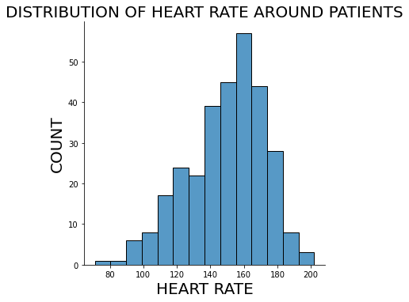 

## 单变量分析结果

通过以上的数据分析我们可以发现：

1. 大部分病人的年龄在50-60岁之间，其中56岁的发病人数最多
2. 整个数据中大约207名男性，96名女性
3. 大部分病人含有典型心绞痛，其他类型心绞痛比较少
4. 大部分人的血压值介于130-140之间
5. 大部分病人的胆固醇含量介于200-250之间
6. 大部分病人的心率介于155-165之间

## 双变量数据分析

```
# 1表示发病几率增加，0表示发病几率减少
# 这里查看年龄是不是对发病几率有影响
# hue参数是表格中的输出标签
# 对age进行分别统计几率增加和减少的数量
plt.figure(figsize=(10,5))
sns.histplot(data = df, x = 'age', hue = 'output')
plt.title("DOES AGE EFFECT THE HEART-ATTACK")
plt.show()
```

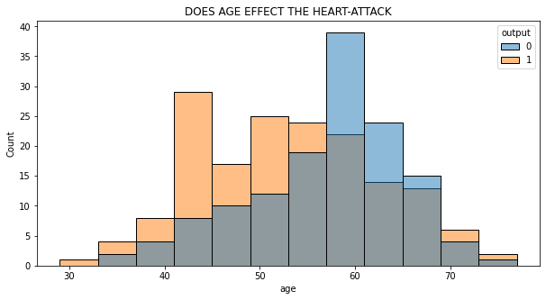 

```
# 绘制交叉透视表
# 统计各个年龄中，发病几率增加和减少的数量
v=pd.crosstab(df["age"],df["output"]).reset_index()
v.head()
```
```
output	age	0	1
0	29	0	1
1	34	0	2
2	35	2	2
3	37	0	2
4	38	1	2
```

```
# 绘制发病率增高随着年龄的变化曲线
v.columns=["age","low_risk","high_risk"]
px.line(v, v["age"], v["high_risk"], title="RISK OF HIGH HEART-ATTACK WITH AGE")
```

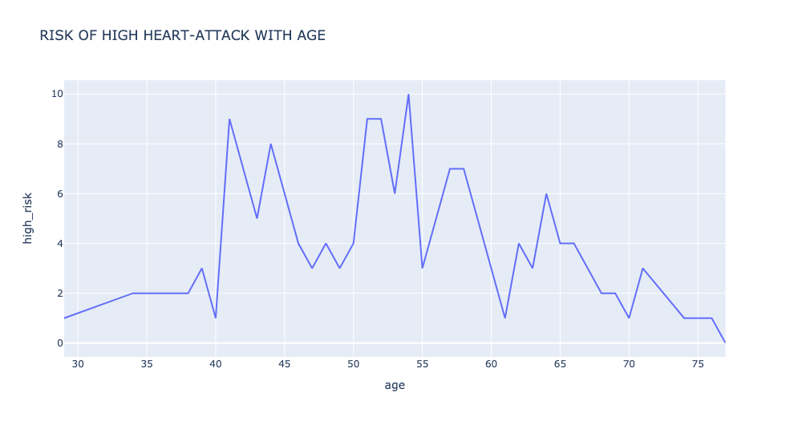 

```
# 绘制发病率降低随年龄的变化曲线
px.line(v, v["age"], v["low_risk"], title="RISK OF LOW HEART-ATTACK WITH AGE")
```

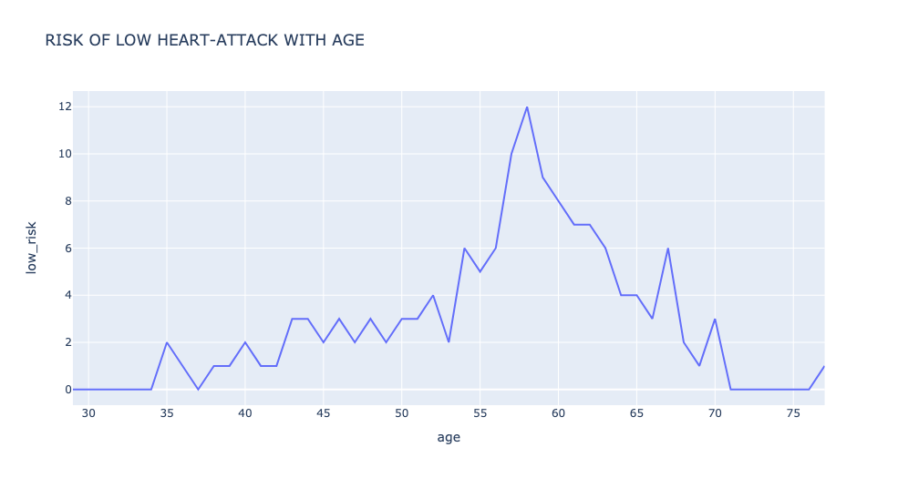 

```
# 血压值随着年龄的变化曲线图
plt.figure(figsize=(20,10))
sns.lineplot(y="trtbps",x="age",data=df)
plt.title("BLOOD PRESSURE WITH AGE",fontsize=20)
plt.xlabel("AGE",fontsize=20)
plt.ylabel("BLOOD PRESSURE",fontsize=20)
plt.show()
```

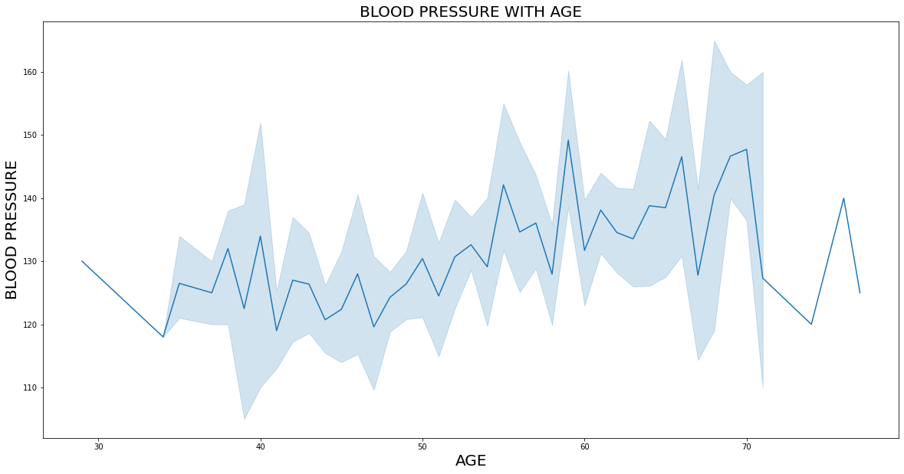 

```
# 胆固醇含量随年龄的变化
plt.figure(figsize=(20,10))
sns.lineplot(y="chol",x="age",data=df)
plt.title("CHOLESTROL LEVEL  WITH AGE",fontsize=20)
plt.xlabel("AGE",fontsize=20)
plt.ylabel("CHOLESTROL LEVEL",fontsize=20)
plt.show()
```

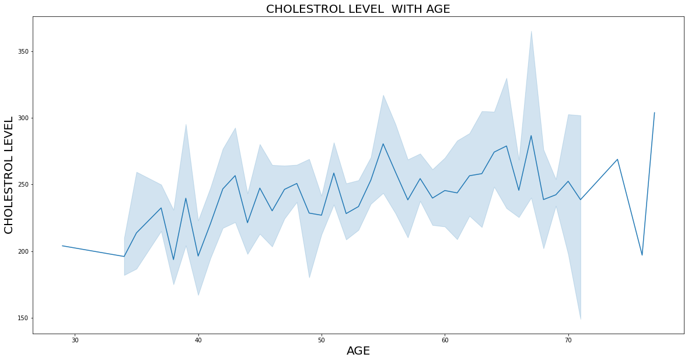 

```

# 心率随着年龄的变化曲线
plt.figure(figsize=(20,10))
sns.lineplot(y="thalachh",x="age",data=df)
plt.title("HEART RATE  WITH AGE",fontsize=20)
plt.xlabel("AGE",fontsize=20)
plt.ylabel("HEART RATE",fontsize=20)
plt.show()
```
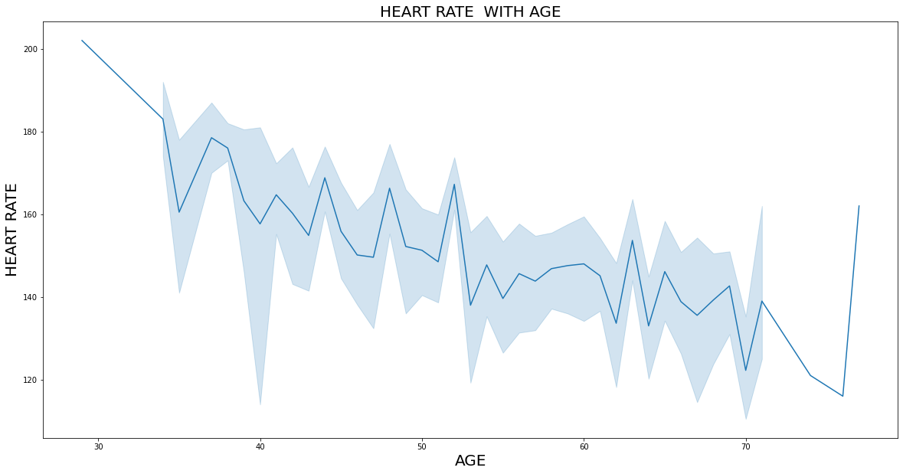 

## 双变量分析结果

通过上面的双变量分析可以得出下面结论：

- 年龄和心脏病发作并没有很强烈的关系。所以我们不能说明心脏病发作的几率随着年龄的增加而增加。
- 血压值会随着年龄的增加而增加
- 随着年龄的增加，胆固醇的含量会越来越多
- 随着年龄的增加，心率也会越来越高

## 多变量分析

```
# 不同发病几率中，胆固醇含量随着年龄的变化曲线
plt.figure(figsize=(10,5))
sns.lineplot(x="age",y="chol",hue="output",data=df)
plt.title("EFFECT OF HEART ATTACK WITH INCREASE IN AGE AND CHOLESTROL")
plt.show()
```

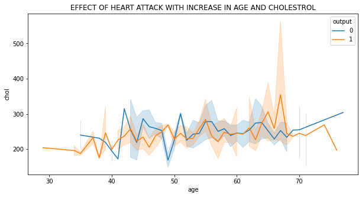 

```
# 不同发病率中，血压值随着年龄的变化曲线
plt.figure(figsize=(10, 5))
sns.lineplot(x="age",y="trtbps",hue="output",data=df)
plt.title("EFFECT OF HEART ATTACK WITH INCREASE IN AGE AND BLOOD PRESSURE")
plt.show()
```

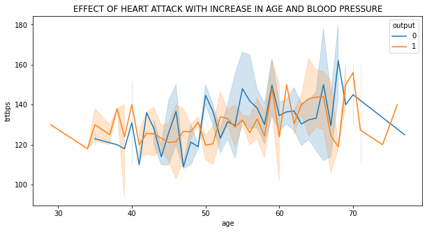 

```
# 不同发病率中， 心率增高随年龄的变化曲线
plt.figure(figsize=(10, 5))
sns.lineplot(x="age",y="thalachh",hue="output",data=df)
plt.title("EFFECT OF HEART ATTACK WITH INCREASE IN AGE AND MAXIMUM HEART RATE")
plt.show()
```

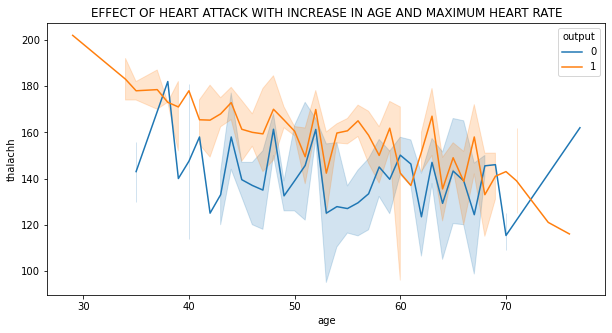 

```
# 相关系数热力图
plt.figure(figsize=(20,5))
sns.heatmap(df.corr(),annot=True,cmap="PuBuGn")
```

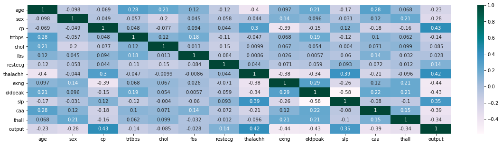 

- 颜色越深表示正相关性越高
- 颜色越浅表示负相关性越高

## 多变量分析结果

- 随着年龄的增加，人体的胆固醇含量确实越来越高，但是胆固醇的含量与心脏病发病几率提升并没有直接的关系
- 血压越高，越容易引起心脏病
- 心率越高，越容易引起心脏病


# 算法概述

## 决策树算法原理

决策树是一种机器学习的方法。决策树的生成算法有ID3, C4.5和C5.0等。决策树是一种树形结构，其中每个内部节点表示一个属性上的判断，每个分支代表一个判断结果的输出，最后每个叶节点代表一种分类结果。决策树是一种十分常用的分类方法，需要监管学习（Supervised Learning），监管学习就是给出一堆样本，每个样本都有一组属性和一个分类结果，也就是分类结果已知，那么通过学习这些样本得到一个决策树，这个决策树能够对新的数据给出正确的分类。

决策树算法流程如下：

1. 选择最好的属性作为测试属性并创建树的根结点
2. 为测试属性每个可能的取值产生一个分支
3. 训练样本划分到适当的分支形成子结点
4. 对每个子节点重复上面的过程，直到所有结点都是叶子结点。

从决策树学习基本算法的步骤可以看出，决策树学习的关键是如何选择最佳划分属性。一般而言，随着长树过程的不断进行，我们希望决策树的分支结点所包含的样本越来越归属于同一类别，即结点的“不纯度”(impurity) 越来越低。

因此，为了确定按某个属性划分的效果，我们需要比较划分前（父亲结点）和划分后（所有儿子结点）不纯度的降低程度，降低越多，划分的效果就越好。那么我们需要在数学上对这个不纯度进行量化：

计算公式如下：

$$
\bigtriangleup = Entropy(parent)-\sum_{j=1}^{k}\frac{N(j)}{N}Entropy(j)  
$$

其中Entropy(parent)是父节点的不纯度，k是划分属性取值的个数。N是父亲节点上样本
总数，N(j)是j个儿子节点上的样本数目，I(j)是第j个儿子节点的不纯度。

## 逻辑回归算法原理

逻辑回归又叫对数几率回归，是一种广义的线性回归分析模型。虽然名字里有回归，但其
实是分类模型，常用于二分类。逻辑回归是通过将线性函数的结果映射到sigmoid函数中
，预估事件出现的概率并分类，sigmoid函数是归一化函数，可以把连续数值转换成为0-1
的范围，提供一种将连续型数据转换成离散数据的方法。因此逻辑回归从直观上来看说是
画出了一条分类线。其中，位于分类线一侧的数据，其概率大于0.5，属于分类A；位于分
类线另一侧的数据，其概率小于0.5，属于分类B。

逻辑回归公式如下：

$$
h_0(x)=\frac{1}{e^{-\theta^Tx}} 
$$

## 支持向量机器算法原理

以二分类问题来讨论SVM的基本概念。考虑两类数据C1和C2，并假设这两类数据线性可分
。对这类问题，我们可以找到多个分类面对C1和C2进行完美划分，但我们希望得到的线性
分类面 $y(x)=w^Tx+b=0$ 具有最大边界属性。具体而言，首先找到C1和C2两类数据样本
中距离L最近的样本集合，每个边界样本集这种的样本到分类面L的距离是相等的，且该距
离在所有分类面中最大化。这一分类面称为最大边界分类面(Max-Margin Hyperplane)，
相应的分类器称为最大边界分类器。上述最大边界分类面的确定仅与边界样本集相关，因
此边界样本集中的训练样本称为支持向量，该分类器称为支持向量机。

 

# 算法实现

导入相应模块

```
from sklearn.linear_model import LogisticRegression
from sklearn.tree import DecisionTreeClassifier
from sklearn.svm import SVC
from sklearn.metrics import accuracy_score, classification_report
from sklearn.preprocessing import MinMaxScaler
from sklearn.model_selection import train_test_split
```

```
df1 = df
# 连续变量和离散变量
cat_cols = ['sex','exng','caa','cp','fbs','restecg','slp','thall']
con_cols = ["age","trtbps","chol","thalachh","oldpeak"]
df1 = pd.get_dummies(df1, columns = cat_cols, drop_first = True)
```

```
X = df1.drop(['output'],axis=1)
y = df1[['output']]
```

```
# 因为不同变量的量纲是不一样的，所以这里要归一化处理
scaler = MinMaxScaler()
X[con_cols] = scaler.fit_transform(X[con_cols])
X_train, X_test, y_train, y_test = train_test_split(X,y, test_size = 0.2, random_state = 42)
```


## 决策树代码实现

```
# instantiating the object
dt = DecisionTreeClassifier(random_state = 42)

# fitting the model
dt.fit(X_train, y_train)

# calculating the predictions
y_pred = dt.predict(X_test)

# printing the test accuracy
print("The test accuracy score of Decision Tree is ", accuracy_score(y_test, y_pred))
```

决策树可视化：

```
# 决策树可视化
from sklearn.tree import export_graphviz
import pydotplus
from IPython.display import Image  

dot_data = export_graphviz(dt,
               feature_names =X.columns,
               ##class_names =df1.output,
               rounded = True, proportion =False,
               precision = 2, filled = True,
               )
graph = pydotplus.graph_from_dot_data(dot_data)  
Image(graph.create_png())
```

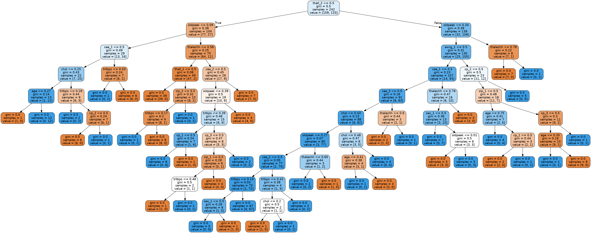 


## 逻辑回归代码实现

```
# instantiating the object
logreg = LogisticRegression()

# fitting the object
logreg.fit(X_train, y_train)

# calculating the probabilities
y_pred_proba = logreg.predict_proba(X_test)

# finding the predicted valued
y_pred = np.argmax(y_pred_proba,axis=1)

# printing the test accuracy
print("The test accuracy score of Logistric Regression is ", accuracy_score(y_test, y_pred))
```

## 支持向量机代码实现

```
# instantiating the object and fitting
clf = SVC(kernel='linear', C=1, random_state=42).fit(X_train,y_train)

# predicting the values
y_pred = clf.predict(X_test)

# printing the test accuracy
print("The test accuracy score of SVM is ", accuracy_score(y_test, y_pred))
```

# 总结

1. 年龄和心脏病发病几率增高并没有很强的关系
2. 心率越高越容易引发心脏病
3. 血压越高越容易引发心脏病
4. 胆固醇含量越高越容易引发心脏病

# 参考

决策树：https://zhuanlan.zhihu.com/p/104462031

逻辑回归：天池大赛书籍

支持向量机：机器学习导论
