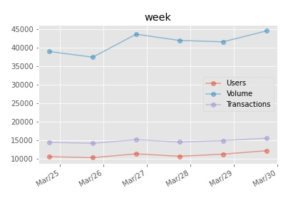
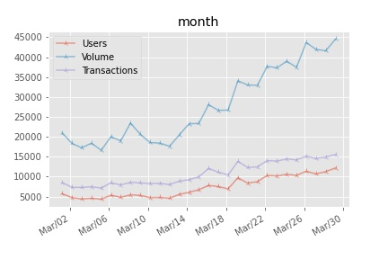
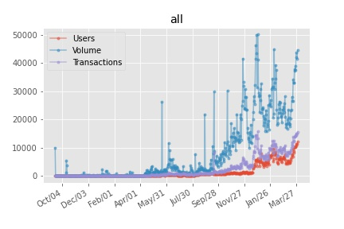
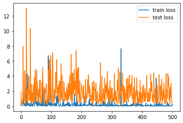
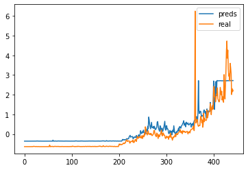
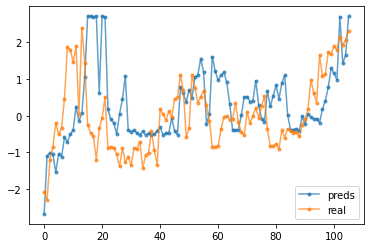

[TOC]

## 区块链爬虫

爬取的网址：https://dappradar.com/thundercore/games/galaxy-blocks

**TODO**：

- [x] Part1 数据爬取
- [x] Part2 数据处理
- [x] Part3 数据可视化
  - [ ] 其实这里可视化还可以对all数据进行操作，比如看一些节假日或者周末的状况。
  - [ ] 参考 [时间序列比赛的可视化](https://github.com/ChuanyuXue/The-Purchase-and-Redemption-Forecast-Challenge-baseline/blob/master/01.%E6%95%B0%E6%8D%AE%E6%8E%A2%E7%B4%A2%E4%B8%8E%E5%88%86%E6%9E%90.ipynb)
- [x] Part4 模型训练
  - [x] 尝试进行预测结果可视化
  - [ ] 将坐标换成日期，有点累现在不想弄
  - [x] 介绍下模型优缺点和对这个问题的可行性
  - [ ] 再使用一个模型，对效果进行对比？
- [x] Part5 结果分析
  - [ ] 要不要介绍下模型，感觉篇幅要很长😓
  - [x] 分析下结果
  - [ ] 分析结果进行补充

### Part1 数据爬取


**要爬取的数据如下，数据是可以动态交互的，这种数据一般直接使用requests模块抓取不到，需要分析网页，找到数据的来源。**


**这种动态的数据交互，一般都是使用ajax技术，后面有json格式的数据进行交互。先对ajax进行分析，使用chrome浏览器自带的抓包功能，抓包结果如图：**


**点击里面的三个文件，可以找到数据请求的URL和数据类型为json**


**接下来可以编写代码对数据进行爬取，找到数据来源以后就比较方便了，直接使用python中的requests模块，对json数据进行请求。**

**直接打开上面的URL，得到的确实是json数据，结果如下：**


**代码测试，看看能不能直接抓取数据：**

```
import requests

week_url = 'https://dappradar.com/v2/api/dapp/thundercore/games/galaxy-blocks/chart/week'
month_url = 'https://dappradar.com/v2/api/dapp/thundercore/games/galaxy-blocks/chart/month'
all_url = 'https://dappradar.com/v2/api/dapp/thundercore/games/galaxy-blocks/chart/all'

week = requests.get(week_url)

with open('res.txt', 'w') as f:
    f.write(week.text)
```

运行代码后，发现抓到的并不是json数据。看看是不是请求参数问题

**修改代码：**

```
import requests

week_url = 'https://dappradar.com/v2/api/dapp/thundercore/games/galaxy-blocks/chart/week'
month_url = 'https://dappradar.com/v2/api/dapp/thundercore/games/galaxy-blocks/chart/month'
all_url = 'https://dappradar.com/v2/api/dapp/thundercore/games/galaxy-blocks/chart/all'

params = {
    ':authority': 'dappradar.com',
    ':path': '/v2/api/dapp/thundercore/games/galaxy-blocks/chart/week',
}

headers = {
    'cookie': '__cfduid=d87b8e46401fad8e04b0395c6f31f22911617082335; _ga=GA1.2.189733543.1617082335; _gid=GA1.2.645825448.1617082335; _rdt_uuid=1617082346122.934071ca-529e-4361-80b4-96f037f64020; _fbp=fb.1.1617082347737.332184334; _hjid=a4521e83-66b7-4bb4-8658-95f6b9a93041; _gat=1; _hp2_id.3928182892=%7B%22userId%22%3A%224342861640682969%22%2C%22pageviewId%22%3A%224126843480895195%22%2C%22sessionId%22%3A%224259085859779402%22%2C%22identity%22%3Anull%2C%22trackerVersion%22%3A%224.0%22%7D; _hjIncludedInSessionSample=1; _hjAbsoluteSessionInProgress=1; _hp2_ses_props.3928182892=%7B%22ts%22%3A1617097371792%2C%22d%22%3A%22dappradar.com%22%2C%22h%22%3A%22%2Fthundercore%2Fgames%2Fgalaxy-blocks%22%7D',
    'user-agent': 'Mozilla/5.0 (Macintosh; Intel Mac OS X 11_1_0) AppleWebKit/537.36 (KHTML, like Gecko) Chrome/88.0.4324.192 Safari/537.36',
}

week = requests.get(week_url, params=params, headers=headers)
```

**结果如下，发现这次对了，原因是没有加cookie和其他参数：**

```
week.json()

# 结果如下
{'series': [{'name': 'Users',
   'data': [12198, 11266, 10695, 11356, 10321, 10584]},
  {'name': 'Volume', 'data': [44540, 41603, 41973, 43661, 37459, 38982]},
  {'name': 'Transactions',
   'data': [15581, 14929, 14558, 15165, 14204, 14457]}],
 'xaxis': [1616976000000,
  1616889600000,
  1616803200000,
  1616716800000,
  1616630400000,
  1616544000000]}
```


**数据抓取部分完整代码如下：**

```
import requests
import pickle

week_url = 'https://dappradar.com/v2/api/dapp/thundercore/games/galaxy-blocks/chart/week'
month_url = 'https://dappradar.com/v2/api/dapp/thundercore/games/galaxy-blocks/chart/month'
all_url = 'https://dappradar.com/v2/api/dapp/thundercore/games/galaxy-blocks/chart/all'

# 请求参数设置
params = {
    ':authority': 'dappradar.com',
    ':path': '/v2/api/dapp/thundercore/games/galaxy-blocks/chart/week',
}

headers = {
    'cookie': '__cfduid=d87b8e46401fad8e04b0395c6f31f22911617082335; _ga=GA1.2.189733543.1617082335; _gid=GA1.2.645825448.1617082335; _rdt_uuid=1617082346122.934071ca-529e-4361-80b4-96f037f64020; _fbp=fb.1.1617082347737.332184334; _hjid=a4521e83-66b7-4bb4-8658-95f6b9a93041; _gat=1; _hp2_id.3928182892=%7B%22userId%22%3A%224342861640682969%22%2C%22pageviewId%22%3A%224126843480895195%22%2C%22sessionId%22%3A%224259085859779402%22%2C%22identity%22%3Anull%2C%22trackerVersion%22%3A%224.0%22%7D; _hjIncludedInSessionSample=1; _hjAbsoluteSessionInProgress=1; _hp2_ses_props.3928182892=%7B%22ts%22%3A1617097371792%2C%22d%22%3A%22dappradar.com%22%2C%22h%22%3A%22%2Fthundercore%2Fgames%2Fgalaxy-blocks%22%7D',
    'user-agent': 'Mozilla/5.0 (Macintosh; Intel Mac OS X 11_1_0) AppleWebKit/537.36 (KHTML, like Gecko) Chrome/88.0.4324.192 Safari/537.36',
}

# 对json数据进行抓取
week = requests.get(week_url, params=params, headers=headers)
month = requests.get(month_url, params=params, headers=headers)
all_ = requests.get(all_url, params=params, headers=headers)

# 使用pickle模块数据保存，由于数据是二进制，所以使用wb模式
pickle.dump(week.json(), open('./week.pkl', 'wb'))
pickle.dump(month.json(), open('./month.pkl', 'wb'))
pickle.dump(all_.json(), open('./all_.pkl', 'wb'))
```

**读取完json文件后，发现json数据中并没有携带日期这个数据，所以需要对代码进行修改，找到日期的数据位置。**

**这里json数据中并没有传输日期数据，所以感觉很奇怪，不过他的日期是按一天一天来的，所以可以手动生成日期**

### Part2 数据处理

**这里有个小细节，仔细观察对应时间和json的数据可以发现，json的数据，并不是按时间顺序来的。如下图中24号Users对应为10.6k，而json数据中第一个为12.2k**


**axis作用为鼠标对应在浏览器的坐标，所以数据的排序应该和坐标有关，从左到右排序。**

**观察数据的结构，代码如下：**

```
import pickle

# 可以发现不管是week，还是month ，all数据，字典都是这种结构，所以可以写成函数的形式
def data_process(data):
    Users, Volume, Transactions = [], [], []
    data = data['series']
    for i in data:
        if i['name'] == 'Users':
            Users.extend(i['data'])
        elif i['name'] == 'Volume':
            Volume.extend(i['data'])
        else:
            Transactions.extend(i['data'])
    return Users, Volume, Transactions

# 使用pickle对数据进行读取
week = pickle.load(open('./week.pkl', 'rb'))
month = pickle.load(open('./month.pkl', 'rb'))
all_ = pickle.load(open('./all_.pkl', 'rb'))

# 打印下数据类型
print(type(week), type(month), type(all_))

# 开始数据处理
week_user, week_volume, week_transactions = data_process(week)
month_user, month_volume, month_transactions = data_process(month)
all_user, all_volume, all_transactions = data_process(all_)
```

**修改后的代码如下：**

```
import pickle
import numpy as np

# 可以发现不管是week，还是month ，all数据，字典都是这种结构，所以可以写成函数的形式
def data_process(data):
    Users, Volume, Transactions = [], [], []
    Position = data['xaxis']
    data = data['series']
    for i in data:
        if i['name'] == 'Users':
            Users.extend(i['data'])
        elif i['name'] == 'Volume':
            Volume.extend(i['data'])
        else:
            Transactions.extend(i['data'])
    
    return Users, Volume, Transactions, Position
    
week = pickle.load(open('./week.pkl', 'rb'))
month = pickle.load(open('./month.pkl', 'rb'))
all_ = pickle.load(open('./all_.pkl', 'rb'))

week_users, week_volume, week_transactions, week_position = data_process(week)
month_users, month_volume, month_transactions, month_position = data_process(month)
all_users, all_volume, all_transactions, all_position = data_process(all_)

# 开始对数据进行排序
def get_rank_data(users, volumn, transaction, position):
    dic = dict(zip(position, range(len(position))))
    p = []
    for i in sorted(dic):
        p.append(dic[i])
    users = np.asarray(users)[p].tolist()
    volumn = np.asarray(volumn)[p].tolist()
    transaction = np.asarray(transaction)[p].tolist()

    return users, volumn, transaction

week_users, week_volume, week_transactions = get_rank_data(week_users, week_volume, week_transactions, week_position)

month_users, month_volume, month_transactions = get_rank_data(month_users, month_volume, month_transactions, month_position)

all_users, all_volume, all_transactions = get_rank_data(all_users, all_volume, all_transactions, all_position)
```

**仔细核对后，数据没错了~**

### Part3 数据可视化

**目前只是简单做了一些可视化～**

```
import datetime
import matplotlib.dates as mdates
import os

# 设置绘图风格
import matplotlib.pyplot as plt
import seaborn as sns
plt.style.use('ggplot')

# 设置中文字符
import matplotlib
matplotlib.rcParams['font.sans-serif'] = ['SimHei']
matplotlib.rcParams['axes.unicode_minus']=False

# 开始封装成函数
def plot_img(users, volume, transactions, time='week'):
    '''
    time: 有week，month， all三种格式，显示时间间隔不一样
    '''
    fig, ax = plt.subplots()
    interval = {'week':1, 'month':4, 'all':60}
    date2 = {'week':datetime.date(2021, 3, 25), 'month':datetime.date(2021, 3, 2), 'all':datetime.date(2019, 9, 17)}
    markers = {'week':'o', 'month':'2', 'all':'.'}

    # 可以设置的参数MONTHLY, WEEKLY, DAILY
    rule = mdates.rrulewrapper(mdates.DAILY, interval=interval[time]) # 设置时间刻度, interval为时间间隔
    loc = mdates.RRuleLocator(rule) # 对时间刻度进行封装
    dateFmt = mdates.DateFormatter('%b/%d')

    ax.xaxis.set_major_locator(loc)
    ax.xaxis.set_major_formatter(dateFmt)

    ax.tick_params(axis='both', direction='out', labelsize=10)

    date1 = datetime.date(2021, 3, 31) # 不管是week还是month，结束时间都是一样的，只是起始时间不一样
    delta = datetime.timedelta(days=1)
    dates = mdates.drange(date2[time], date1, delta)

    ax.plot_date(dates, users, '-', alpha=0.5, marker=markers[time], label='Users')
    ax.plot_date(dates, volume, '-', alpha=0.5, marker=markers[time], label='Volume')
    ax.plot_date(dates, transactions, '-', alpha=0.5, marker=markers[time], label='Transactions')

    plt.legend() # 添加图例
    plt.title(time) # 添加标题
    fig.autofmt_xdate()
    img_name = time + '.jpg'
    if not os.path.exists('./picture'):
        os.mkdir('./picture')
    plt.savefig('./picture/' + img_name) # 图片保存
    plt.show()
    
plot_img(week_users, week_volume, week_transactions, time='week')
plot_img(month_users, month_volume, month_transactions, time='month')
plot_img(all_users, all_volume, all_transactions, time='all')
```








### Part4 时间序列预测

**什么是时间序列预测问题？**

时间序列预测问题是一种自回归问题，自回归就是` Y(t) = a*Y(t-1) + b*Y(t-2)`，即现在的Y值，由过去的Y值确定。

**传统的自回归模型有哪些？**

自回归模型AR，移动平均模型 MA， 自回归移动平均模型 ARMA等。

**模型可行性分析：**

对于时间序列，普通的dnn，cnn神经网络并不好处理这种问题，LSTM是RNN神经网络的一种，能够很好地解决时间序列中的记忆性问题。所以这里使用LSTM对transaction进行分析预测。

**LSTM Pytorch代码实现**

- **数据读取和处理部分：**

```
# 导入必要模块
import pandas as pd
import numpy as np
import os
import matplotlib.pyplot as plt
from sklearn.preprocessing import MinMaxScaler
import pickle
import gc
import datetime
import time
from sklearn.model_selection import train_test_split
import torch
import torch.nn as nn
from torch import optim
from torch.utils.data import Dataset, DataLoader
from tqdm import tqdm

# 可以发现不管是week，还是month ，all数据，字典都是这种结构，所以可以写成函数的形式
def data_process(data):
    Users, Volume, Transactions = [], [], []
    Position = data['xaxis']
    data = data['series']
    for i in data:
        if i['name'] == 'Users':
            Users.extend(i['data'])
        elif i['name'] == 'Volume':
            Volume.extend(i['data'])
        else:
            Transactions.extend(i['data'])
    
    return Users, Volume, Transactions, Position

# 对日期进行排序
def get_rank_data(users, volumn, transaction, position):
    dic = dict(zip(position, range(len(position))))
    p = []
    for i in sorted(dic):
        p.append(dic[i])
    users = np.asarray(users)[p].tolist()
    volumn = np.asarray(volumn)[p].tolist()
    transaction = np.asarray(transaction)[p].tolist()

    return users, volumn, transaction

# 数据读取和处理
week = pickle.load(open('./data/week.pkl', 'rb'))
month = pickle.load(open('./data/month.pkl', 'rb'))
all_ = pickle.load(open('./data/all_.pkl', 'rb'))

week_users, week_volume, week_transactions, week_position = data_process(week)
month_users, month_volume, month_transactions, month_position = data_process(month)
all_users, all_volume, all_transactions, all_position = data_process(all_)

week_users, week_volume, week_transactions = get_rank_data(week_users, week_volume, week_transactions, week_position)
month_users, month_volume, month_transactions = get_rank_data(month_users, month_volume, month_transactions, month_position)
all_users, all_volume, all_transactions = get_rank_data(all_users, all_volume, all_transactions, all_position)

# 没有用的变量可以删掉，避免占用内存
del week, month, all_, week_position, month_position, all_position; gc.collect()

# 因为没有时间，所以这里针对数据创建时间
date = pd.date_range('2019-9-17', '2021-3-30', freq='D') # 生成30号一共561个数据

# 创建pandas对象
df = pd.DataFrame({
    'transactions':all_transactions,
    'date':date
})

df = df.set_index(df.date)
del df['date']

data = df.sort_index(ascending=True, axis=0) # 按时间进行排序，虽然数据前面已经处理好了

# 训练集和测试集的划分
train, test = train_test_split(data, test_size=0.2, shuffle=False) # 因为默认shuffle是打乱，这里设置为False
```

- **数据转换：**

```
# 数据归一化，不然loss降不下来
window = 7 # 设置时间窗口，构造训练集和标签

# 构造数据集是为了输入到LSTM中
x_train, y_train = [], []
# 窗口为30表示，用30长度窗口滑动，前30个样本作为特征，后1个样本作为标签
for i in range(window, len(train)):
    x_train.append(train.values[i-window:i].flatten())
    y_train.append(train.values[i].flatten())
    
x_test, y_test = [], []
# 窗口为30表示，用30长度窗口滑动，前30个样本作为特征，后1个样本作为标签
for i in range(window, len(test)):
    x_test.append(test.values[i-window:i, 0].flatten())
    y_test.append(test.values[i, 0].flatten())
    
train_numpy = np.array(x_train)
train_mean = np.mean(train_numpy)
train_std  = np.std(train_numpy)
train_numpy = (train_numpy - train_mean) / train_std
train_tensor = torch.Tensor(train_numpy)

label_numpy = np.array(y_train)
label_mean = np.mean(label_numpy)
label_std  = np.std(label_numpy)
label_numpy = (label_numpy - label_mean) / label_std
train_labels = torch.Tensor(label_numpy)

test_numpy = np.array(x_test)
test_mean = np.mean(test_numpy)
test_std  = np.std(test_numpy)
test_numpy = (test_numpy - test_mean) / test_std
test_tensor = torch.Tensor(test_numpy)

label_numpy = np.array(y_test)
label_mean = np.mean(label_numpy)
label_std  = np.std(label_numpy)
label_numpy = (label_numpy - label_mean) / label_std
test_labels = torch.Tensor(label_numpy)
```

- **开始建模：**

```
class LSTM(nn.Module):
    def __init__(self):
        super(LSTM, self).__init__()
        
        self.lstm = nn.LSTM(
            input_size=1,   # 输入尺寸为 1，表示一天的数据
            hidden_size=64,
            num_layers=1, 
            batch_first=True)
        
        self.out = nn.Sequential(
            nn.Linear(64,1))
        
    def forward(self, x):
        r_out, (h_n, h_c) = self.lstm(x, None)   # None 表示 hidden state 会用全 0 的 state
        out = self.out(r_out[:, -1, :])          # 取最后一天作为输出
        
        return out
class MyDataset(Dataset):
    def __init__(self, features, labels, transformer=True):
        super().__init__()
        if transformer:
            self.features = torch.tensor(features).float().unsqueeze(dim=-1)
            self.labels = torch.tensor(labels).float()
        else:
            self.features = features.float().squeeze().unsqueeze(dim=-1)
            self.labels = labels.float()
    
    def __getitem__(self, idx):
        return self.features[idx], self.labels[idx]
    
    def __len__(self):
        return len(self.labels)    
lr = 0.01
EPOCHS = 500
gamma = 0.5
step_size = 100

train_set = MyDataset(train_tensor, train_labels, transformer=False)
train_loader = DataLoader(train_set, batch_size=10, shuffle=True)
test_set = MyDataset(test_tensor, test_labels, transformer=False)
test_loader = DataLoader(test_set, batch_size=10, shuffle=True)

model = LSTM().cuda()
criterion = nn.MSELoss()
optimizer = optim.Adam(model.parameters(), lr=0.8)
scheduler = optim.lr_scheduler.StepLR(optimizer, step_size=step_size, gamma=gamma)
```

- **模型训练：**

```
train_loss = []
test_loss = []

for epoch in range(EPOCHS):
    model.train()
    for x, y in train_loader:
        var_x = x.cuda()
        var_y = y.cuda()

        out = model(var_x)

        loss = criterion(out, var_y)

        optimizer.zero_grad()
        loss.backward()
        optimizer.step()
    if epoch % 50 == 0:
        print(f'EPOCH:{epoch},Train Loss:{loss.item():.5f}')

    train_loss.append(loss.item())
    model.eval()
    with torch.no_grad():
        for x, y in test_loader:
            var_tx = x.cuda()
            var_ty = y.cuda()

            out = model(var_tx)
            loss = criterion(out, var_ty)
        test_loss.append(loss.item())
            
    if epoch % 50 == 0:
        print(f'Test Loss:{loss.item():.5f}')
    
    scheduler.step() # 学习率递减
```

- **查看预测结果：**

```
# loss变化曲线
plt.figure()
plt.plot(train_loss, label='train loss')
plt.plot(test_loss, label='test loss')
plt.legend()
plt.show()
```



- **预测结果可视化：**

```
# 训练结果可视化
train_preds = []
for x in tqdm(train_tensor):
    x = x.unsqueeze(dim=-1).unsqueeze(dim=0).cuda()
    preds = model(x)
    train_preds.append(preds.item())
plt.figure()
plt.plot(train_preds, label='preds')
plt.plot(train_labels, label='real')
plt.legend()
plt.show()
```



```
# 测试结果可视化
test_preds = []
for x in tqdm(test_tensor):
    x = x.unsqueeze(dim=-1).unsqueeze(dim=0).cuda()
    preds = model(x)
    test_preds.append(preds.item())
    
plt.figure()
plt.plot(test_preds, '.-', label='preds', alpha=0.7)
plt.plot(test_labels, '.-', label='real', alpha=0.7)
plt.legend()
plt.show()
```



### Part5 结果分析

在模型中，我们使用前7天的数据，预测后一天的数据。从训练结果来看，预测值很好地拟合了原来的真实值。

但仔细查看结果，可以发现LSTM预测第二天的结果，只是很接近前一天的值。所以，LSTM并不能很好地预测这种金融数据！

所以对于金融领域，没有可靠的算法是可以预测其走向的！因为金融的交易收到很多因素的影响，还有一些无形的因素是无法事先预测的！

**参考：**

- pytorch 模型代码讲解：https://mp.weixin.qq.com/s/Ge1rZszg4IiLMNo7Y0KDAw

> 读完后就知道代码k输入是什么样子

- lstm实现股票预测：https://github.com/TankZhouFirst/Pytorch-LSTM-Stock-Price-Predict

> 看完后就知道模型要怎么构建

- lstm 模型理论讲解：https://zhuanlan.zhihu.com/p/32085405

> 看完后能够了解模型的理论知识

- 机器之心：https://www.jiqizhixin.com/articles/2019-01-04-16

> 使用了多个模型进行预测，并对效果进行了预测，但是代码版本不一样

- 深度学习做股票预测靠谱吗：https://www.zhihu.com/question/54542998

> 有说靠谱的，也有说不靠谱的，但是不靠谱的多，看你自己怎么想

- kaggle 商品交易量预测：https://www.kaggle.com/zhangyunsheng/xgboost
    
  - 比赛地址：https://www.kaggle.com/c/competitive-data-science-predict-future-sales/code
  - 参考项目：https://www.kaggle.com/yasserhessein/predict-future-sales-using-4-algorithms-regression
